# Авторизация
| № | Название проверки                                                                                                          | Результат    | Описание проблемы                      | Скриншот                                                                  |
|---|----------------------------------------------------------------------------------------------------------------------------|--------------|----------------------------------------|---------------------------------------------------------------------------|
| 1 | При вводе неверных логина или пароля выводит ошибку                                                                        | Положительно |                                        | 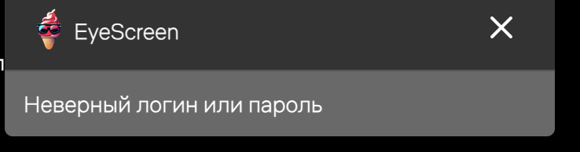                             |
| 2 | Пароль должен содержать минимум 8 символов, включая хотя бы 1 латинскую букву и 1 заглавную                                | Положительно |                                        |  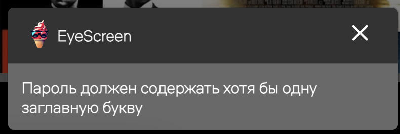 |
| 3 | При вводе верных логина и пароля редиректит на страницу [feed](https://hooli-smotrim.ru/feed)                              | Положительно |                                        |                                                                           |
| 4 | При нажатии на кнопку "Зарегистрируйтесь" редиректит на страницу [start-register](https://hooli-smotrim.ru/start-register) | Положительно |                                        | 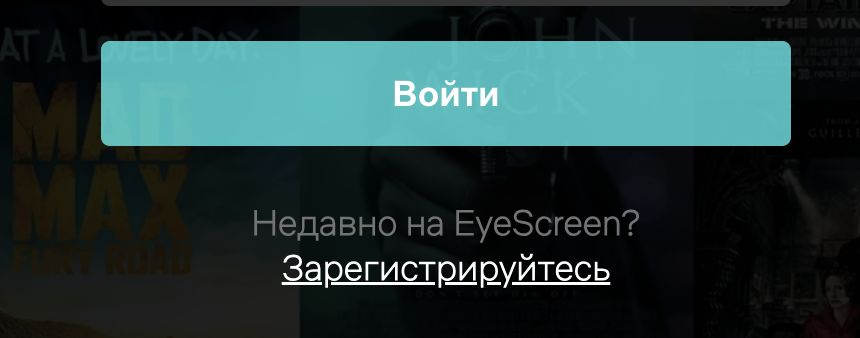                                      |
| 5 | Работает автоподстановка логина и пароля                                                                                   | Положительно |                                        |                                                                           |
| 6 | При вводе пароля с длиной меньшей минимального количества символов выводится ошибка                                        | Положительно |                                        |                                                                           |
| 7 | При вводе пароля с длиной большей максимального количества символов выводится ошибка                                       | Отрицательно | Нет ограничения на количество символов |                                                                           |
| 8 | При вводе пароля в поле все символы заменяются на *                                                                        | Положительно |                                        | 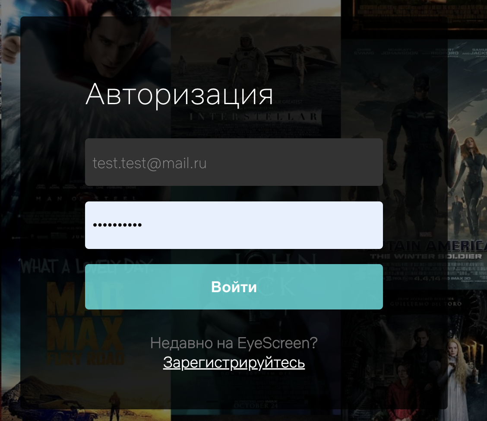                                      |

# Регистрация
| №  | Название проверки                                                                                                  | Результат           | Описание проблемы                          | Скриншот                             |
|----|--------------------------------------------------------------------------------------------------------------------|---------------------|--------------------------------------------|--------------------------------------|
| 1  | При первом посещении сайта пользователя встречает приветственное окно с предложением зарегистрироваться            | Положительно        |                                            |  |
| 2  | Если оставить поле для почты пустое и нажать кнопку "Начать", то выведется сообщение об ошибке                     | Положительно        |                                            |  |
| 3  | При вводе почты и нажатии кнопки "Начать" пользователю предлагается заполнить форму для регистрации                | Положительно        |                                            |  |
| 4  | При вводе соответствующих требованиям логина и пароля редиректит на страницу [feed](https://hooli-smotrim.ru/feed) | Положительно        |                                            |                                      |
| 5  | При вводе пароля с длиной меньшей минимального количества символов (8) выводится ошибка                            | Положительно        |                                            |                                      |
| 6  | При вводе пароля с длиной большей максимального количества символов выводится ошибка                               | Отрицательно        | Нет ограничения на количество символов     |                                      |
| 7  | При вводе emoji в логине или пароле выводится ошибка                                                               | Положительно        |                                            |                                      |
| 8  | При вводе почты без символа "@" или без символов после "@" выводится ошибка                                        | Положительно        |                                            |                                      |
| 9  | При отсутствии кода страницы (например, ".ru") выводится ошибка                                                    | Отрицательно        | Есть возможность ввести некорректную почту |                                      |
| 10 | Инпуты логина и пароля допускают ввод специальных символов                                                         | Положительно        |                                            |                                      |
| 11 | При вводе пароля в поле все символы заменяются на *                                                                | Положительно        |                                            | 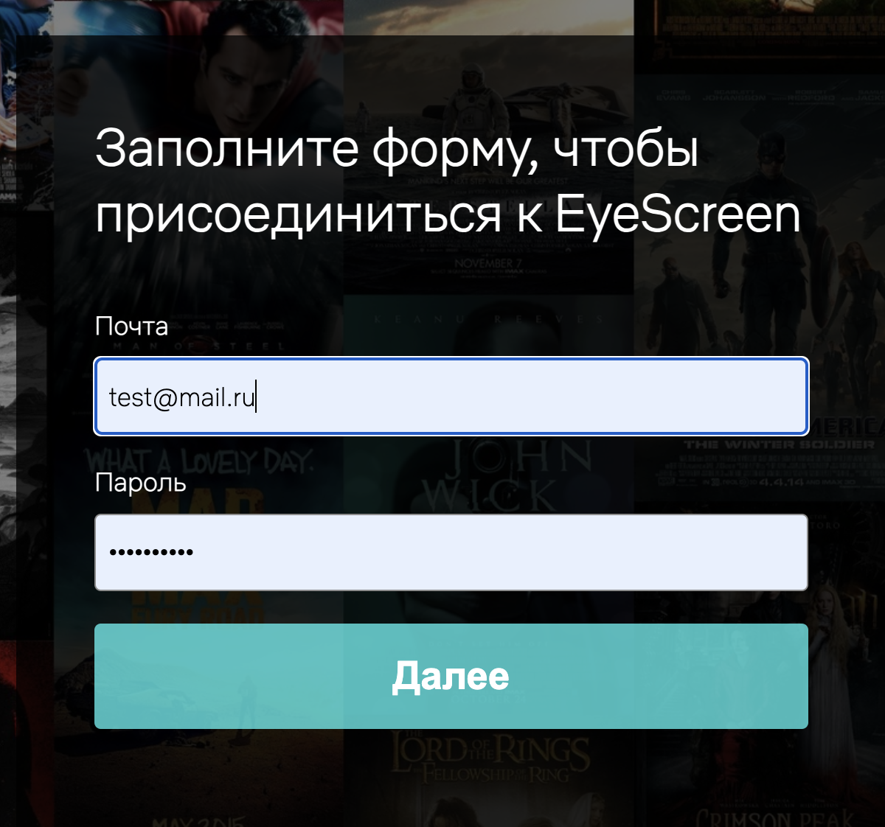 | 

# Навбар
| №  | Название проверки                                                                                                                      | Результат    | Описание проблемы        | Скриншот                        |
|----|----------------------------------------------------------------------------------------------------------------------------------------|--------------|--------------------------|---------------------------------|
| 1  | При нажатии на лого редиректит на страницу [feed](https://hooli-smotrim.ru/feed)                                                       | Положительно |                          |  |
| 2  | При нажатии на кнопку "Фильмы" редиректит на страницу [feed](https://hooli-smotrim.ru/feed)                                            | Положительно |                          |                                 |
| 3  | При нажатии на кнопку "Сериалы" редиректит на страницу [serials](https://hooli-smotrim.ru/serials)                                     | Положительно |                          |                                 |
| 4  | При нажатии на кнопку "Избранное" редиректит на страницу [list](https://hooli-smotrim.ru/list)                                         | Положительно |                          |                                 |
| 5  | При наведении на иконку профиля появляется выпадающий список                                                                           | Положительно |                          | 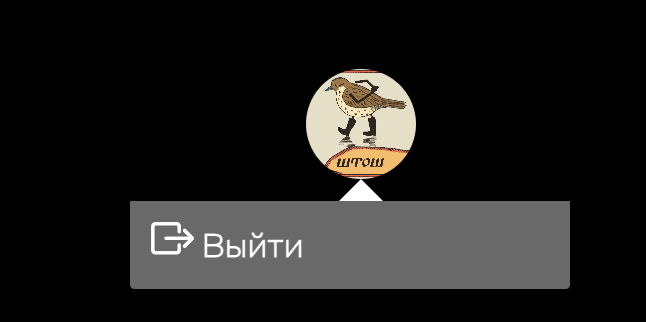 |
| 6  | При нажатии на кнопку "Выйти" производится выход из аккаунта и происходит редирект на страницу [login](https://hooli-smotrim.ru/login) | Положительно |                          |                                 |
| 7  | При навигации через навбар перерендеривается только изменяющаяся часть страницы                                                        | Отрицательно | Обновляется вся страница |                                 |
| 8  | На страницах не требующих авторизации нет кнопки "Выйти"                                                                               | Положительно |                          |                                 |
| 9  | На страницах требующих авторизации и страницах логина и регистрации нет кнопки "Войти"                                                 | Положительно |                          |                                 |
| 10 | При ширине экрана меньшей 900px навбар складывается в бургер                                                                           | Положительно |                          |                                 |

# Уведомления об ошибках
| №  | Название проверки                                                                         | Результат    | Описание проблемы                                                                                                         | Скриншот                              |
|----|-------------------------------------------------------------------------------------------|--------------|---------------------------------------------------------------------------------------------------------------------------|---------------------------------------|
| 1  | Время исчезновения уведомления меньше 10 сек                                              | Положительно |                                                                                                                           | 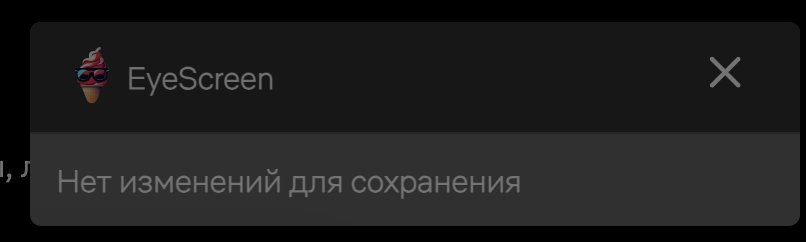 |
| 2  | При нажатии на кнопку крестика уведомление скрывается                                     | Положительно |                                                                                                                           |                                       |
| 3  | Появление нескольких уведомлений одновременно не влияет на время исчезновения последующих | Отрицательно | При появлении нескольких уведомлений одновременно время исчезновения последующих уменьшается и начинает рандомно меняться |                                       |
| 4  | Уведомления не ломают основную верстку сайта                                              | Положительно |                                                                                                                           |                                       |
| 5  | При нажатии в область экрана не относящуюся к уведомлению оно не исчезает                 | Положительно |                                                                                                                           |                                       |

# Редактирование данных пользователя
| №  | Название проверки                                                                                                     | Результат     | Описание проблемы                                                                                                                                                                                      | Скриншот                                 |
|----|-----------------------------------------------------------------------------------------------------------------------|---------------|--------------------------------------------------------------------------------------------------------------------------------------------------------------------------------------------------------|------------------------------------------|
| 1  | В профиле пользователя есть раздел "Редактировать"                                                                    | Положительно  |                                                                                                                                                                                                        | 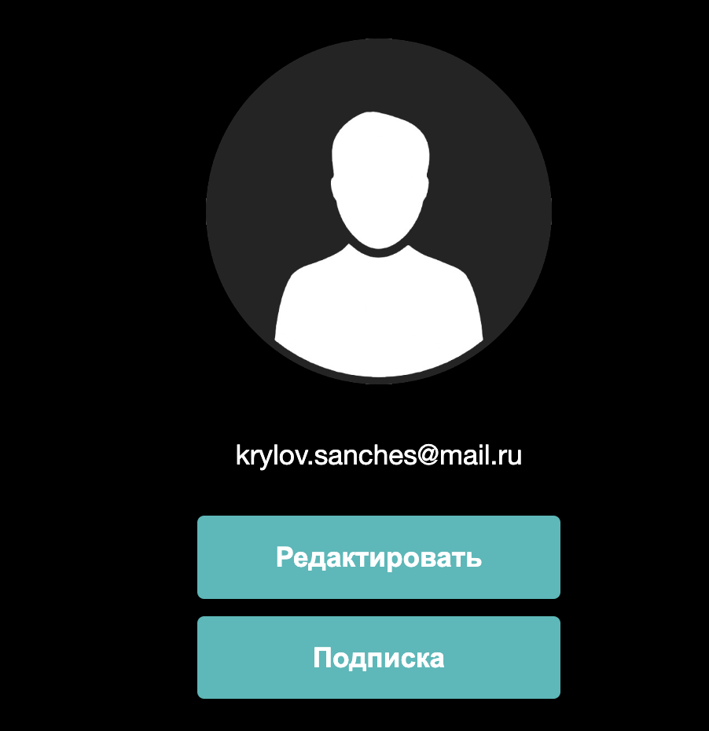 |
| 2  | При нажатии кнопки редактировать открывается окно для смены почты и пароля, а также для загрузки аватара              | Положительно  |                                                                                                                                                                                                        |  |
| 3  | Поле ввода почты должно соответствовать формату email                                                                 | Положительно  |                                                                                                                                                                                                        |                                          |
| 4  | При вводе пароля длиной меньше допустимой отображается сообщение об ошибке                                            | Положительно  |                                                                                                                                                                                                        |                                          |
| 5  | При вводе пароля длиной больше допустимой отображается сообщение об ошибке                                            | Отрицательно  | Нет ограничения на максимальную длину                                                                                                                                                                  |                                          |
| 6  | Поле пароля допускают ввод только латинских букв, цифр и спец. символов                                               | Отрицательно  | Допускается ввод русских букв                                                                                                                                                                          |                                          |
| 7  | При вводе почты и пароля, не соответствующим требуемым форматам, при редактировании данные обновить невозможно        | Положительно  |                                                                                                                                                                                                        |                                          |
| 8  | При вводе корректных значений данные профиля обновляются, и редиректит на [profile](https://hooli-smotrim.ru/profile) | Положительно  |                                                                                                                                                                                                        |                                          |
| 9  | Ввод уже зарегистрированной почты невозможен                                                                          | Отрицательно  | Редиректит на [profile](https://hooli-smotrim.ru/profile), но изменения не применяются, отсутствиет сообщение об ошибке, при повторной попытке редактирования значение почты в форме становится пустым |                                          |
| 10 | При выборе картинки для аватара отображается превью (часть картинки, которая будет отображаться на сайте)             | Положительно  |                                                                                                                                                                                                        | 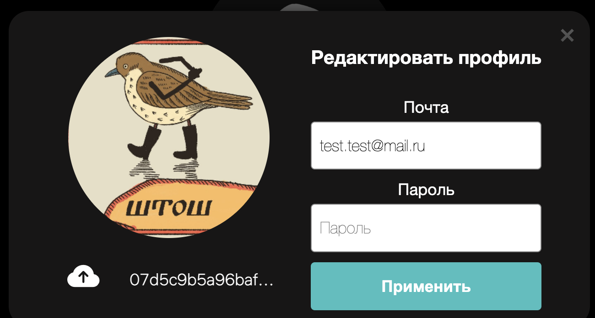 |
| 11 | При выборе картинки для аватара отображается название файла, но не больше допустимой длины                            | Положительно  |                                                                                                                                                                                                        |                                          |
| 12 | После нажатия кнопки применить редиректит на [profile](https://hooli-smotrim.ru/profile) и аватар обновляется         | Положительно  |                                                                                                                                                                                                        | 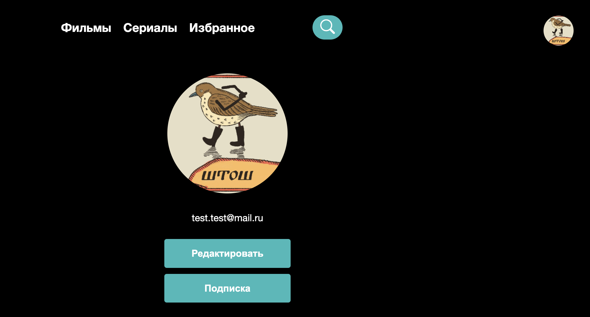 |
| 13 | При попытке загрузить неподдерживаемый формат отображается сообщение об ошибке, доступны jpg, png, svg, webp          | Положительно  |                                                                                                                                                                                                        |                                          |
| 14 | Ограничение на вес загружаемого файла                                                                                 | Отрицательно  | Нужно добавить ограничение "сверху" на размер загружаемых файлов                                                                                                                                       |                                          |

# Оформление подписки
| № | Название проверки                                                                                                                                         | Результат     | Скриншот                            |
|---|-----------------------------------------------------------------------------------------------------------------------------------------------------------|---------------|-------------------------------------|
| 1 | В профиле пользователя есть раздел "Подписка"                                                                                                             | Положительно  |  |
| 2 | Если у пользователя нет подписки, то в разделе "Подписка" есть кнопка "Оплатить" и информация о цене и о том, что пользователь приобретает                | Положительно  |  |
| 3 | При нажатии кнопки "Оплатить" происходит редирект на Юmoney для физической оплаты                                                                         | Положительно  | 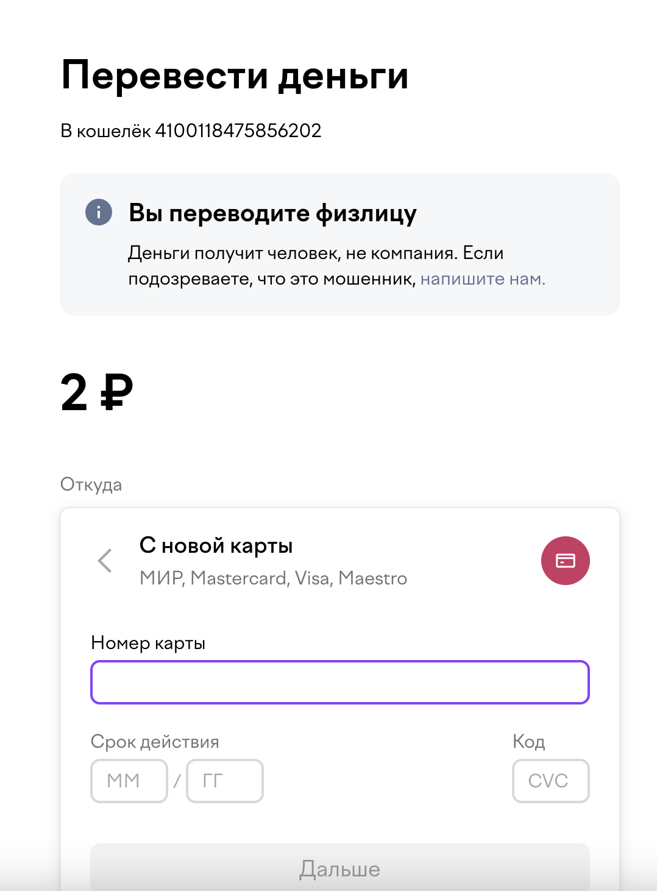 |
| 4 | При успешной оплате редиректит на https://hooli-smotrim.ru/profile и появляется информация о сроке действия подписки                                      | Положительно  | 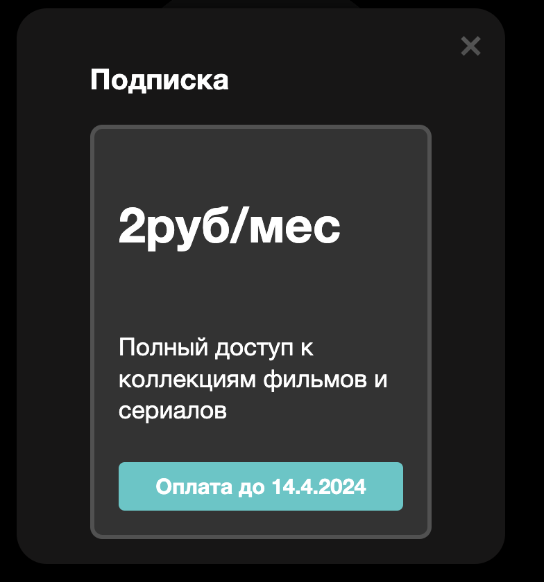 |
| 5 | При наличии подписки есть возможность воспроизвести видео на странице фильма или сериала                                                                  | Положительно  | 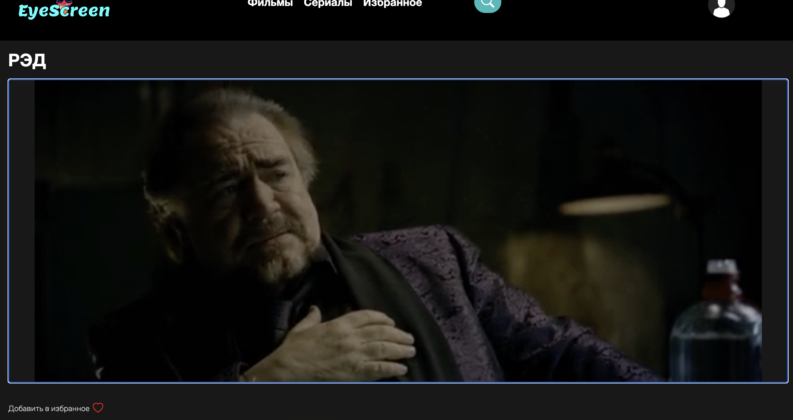 |
| 6 | При отсутствии подписки нет возможности воспроизвести видео на странице фильма или сериала                                                                | Положительно  | 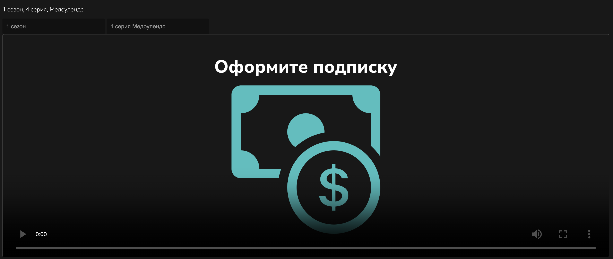  |
| 7 | При заходе на страницу фильма без подписки отображается информационное окно, предлагающее оформить подписку и ссылкой на https://hooli-smotrim.ru/profile | Положительно  | 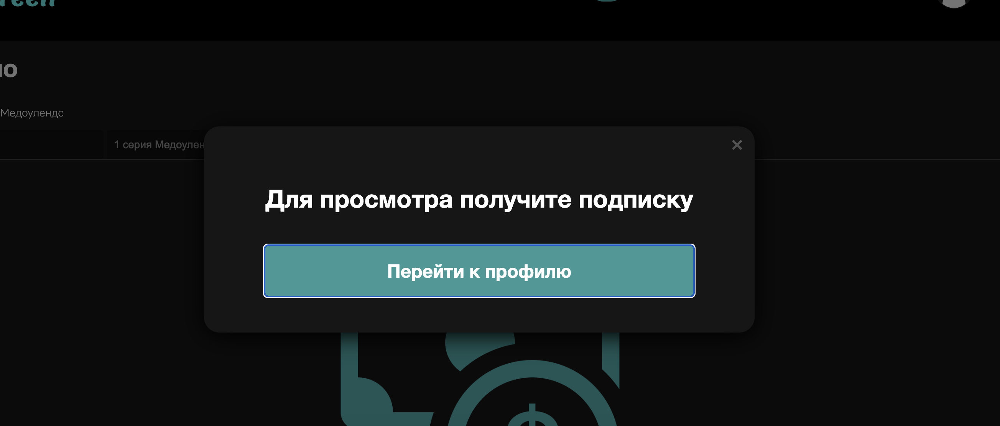  |

# Поиск
| № | Название проверки                                                                            | Результат     | Описание проблемы                                                                                                                  | Скриншот                          |
|---|----------------------------------------------------------------------------------------------|---------------|------------------------------------------------------------------------------------------------------------------------------------|-----------------------------------|
| 1 | Поиск по фильмам, сериалам и актёрам доступен на каждой странице сайта в навбаре             | Положительно  |                                                                                                                                    |  |
| 2 | При нажатии на иконку поиска открывается поле для ввода запроса                              | Положительно  |                                                                                                                                    |  |
| 3 | При успешном поиске на его странице отображаются подходящие сериалы, фильмы, актеры          | Положительно  |                                                                                                                                    | 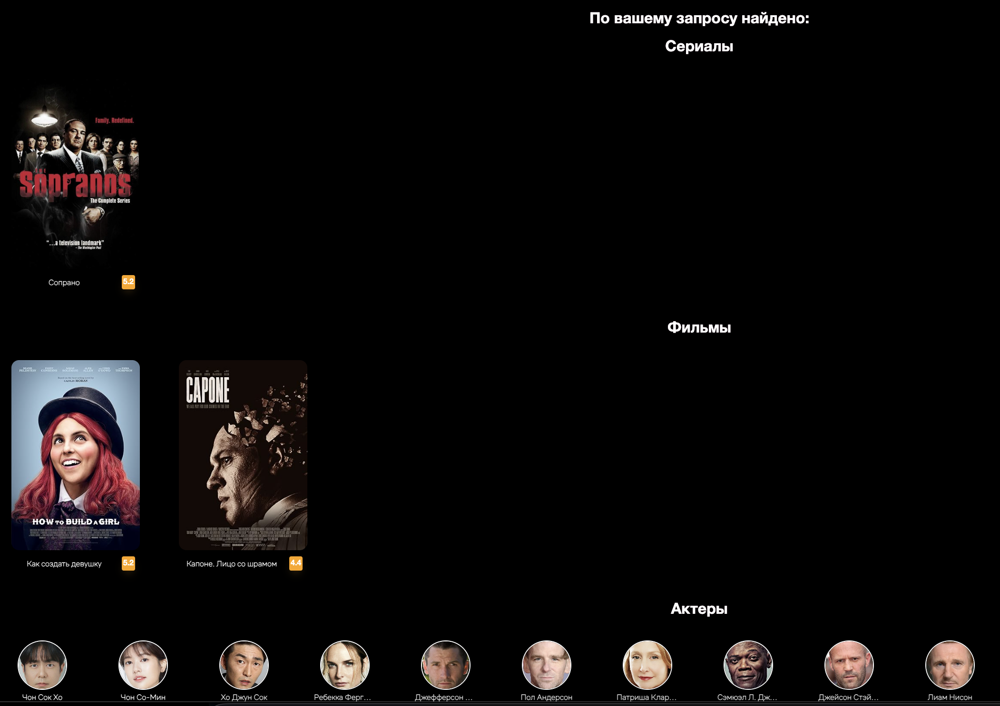 |
| 4 | При вводе поискового запроса и нажатия кнопки Ввод редиректит на страницу поиска             | Отрицательно  | После ввода через заданное время с момента ввода последнего символа автоматически происходит редирект, нет перехода по кнопке Ввод |                                   |
| 5 | При пустом результате запроса отображается информационное сообщение и редирект не происходит | Положительно  |                                                                                                                                    | 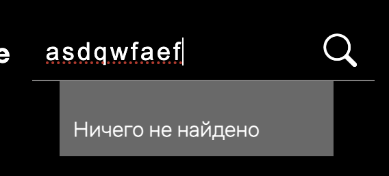 |
| 6 | Допускается вместо буквы "ё" вводить "е"                                                     | Отрицательно  | Поисковик не воспринимает "е" вместо "ё"                                                                                           |                                   |
| 7 | При успешном результате поиска отображать пользователю n наиболее подходящих результатов     | Отрицательно  | На некоторые запросы находится очень много соответствий, за счёт чего занимается очень много места на странице                     | 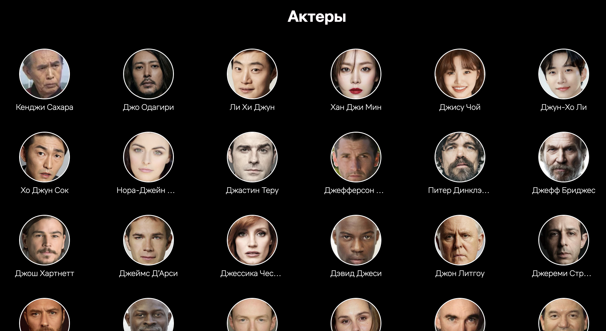 |

# Добавление в избранное
| № | Название проверки                                                                                                                                    | Результат    | Описание проблемы | Скриншот                                                              |
|---|------------------------------------------------------------------------------------------------------------------------------------------------------|--------------|-------------------|-----------------------------------------------------------------------|
| 1 | При добавлении фильма/сериала в избранное отображается анимация в виде заполнения сердечка                                                           | Положительно |                   | 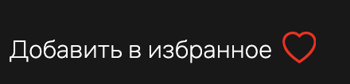 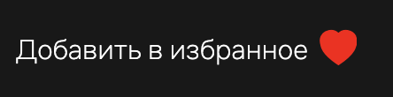 |
| 2 | После добавления фильма/сериала в избранное данный фильм/сериал начинает отображается в разделе "Избранное", по ссылке https://hooli-smotrim.ru/list | Положительно |                   |                                     |
| 3 | При удалении фильма/сериала из избранного отображается анимация в виде затемнения сердечка                                                           | Положительно |                   |                                                                       |
| 4 | При удалении фильма/сериала из избранного данный фильм/сериал пропадает из раздела "Избранное" без обновления страницы                               | Положительно |                   |                                                                       |

# Подборки фильмов
| № | Название проверки                                                              | Результат     | Описание проблемы                                                             | Скриншот                                     |
|---|--------------------------------------------------------------------------------|---------------|-------------------------------------------------------------------------------|----------------------------------------------|
| 1 | Переход на страницу сериала с самым высоким рейтингом по кнопке "Смотреть"     | Положительно  |                                                                               |   |        
| 2 | Переход на страничку подборки, при нажатии на заголовок подборки               | Положительно  |                                                                               |  |        
| 3 | Горизонтальные скролл мышкой, тач в карусели подборки вплоть до конца подборки | Положительно  |                                                                               |                                              |        
| 4 | Клик по превью фильма в подборке - редирект на страницу сериала                | Отрицательно  | Ничего не происходит. Обработка клика только на названии фильма при наведении |                                              |        
| 5 | Фильмы в подборке отсортированы по рейтингу в порядке убывания                 | Положительно  |                                                                               |                                              |        
| 6 | Отображаются заголовки и карточки с контентом                                  | Положительно  |                                                                               |                                              |

# Подборки сериалов
| № | Название проверки                                                              | Результат    | Описание проблемы                                                              | Скриншот                                    |
|---|--------------------------------------------------------------------------------|--------------|--------------------------------------------------------------------------------|---------------------------------------------|
| 1 | Переход на страницу сериала с самым высоким рейтингом по кнопке "Смотреть"     | Положительно |                                                                                |  |
| 2 | Переход на страничку подборки, при нажатии на заголовок подборки               | Положительно |                                                                                |   |
| 3 | Горизонтальные скролл мышкой, тач в карусели подборки вплоть до конца подборки | Положительно |                                                                                |                                             |
| 4 | Клик по превью сериала в подборке - редирект на страницу сериала               | Отрицательно | Ничего не происходит. Обработка клика только на названии сериала при наведении |                                             |
| 5 | Сериалы в подборке отсортированы по рейтингу в порядке убывания                | Положительно | 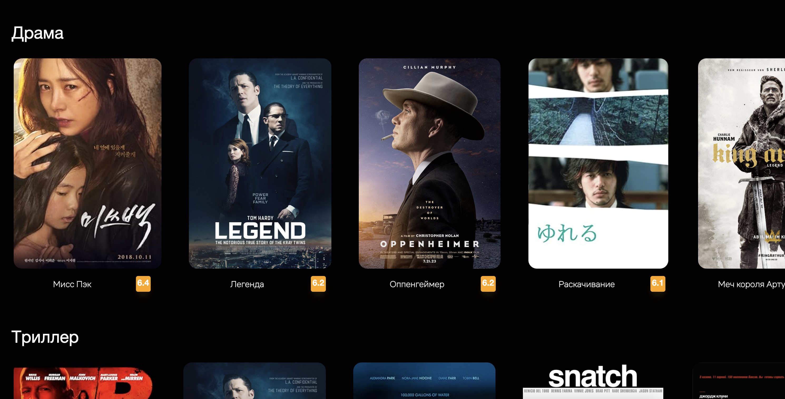                                    |                                             |

# Страница фильма
| № | Название проверки                                                                                                      | Результат    | Скриншот                                  | 
|---|------------------------------------------------------------------------------------------------------------------------|--------------|-------------------------------------------|
| 1 | При отсутствии подписки возможности воспроизвести видео                                                                | Положительно |  |     
| 2 | При отсутствии подписки при переходе на страницу фильма показываем окно с информацией о подписке и переходом на оплату | Положительно | 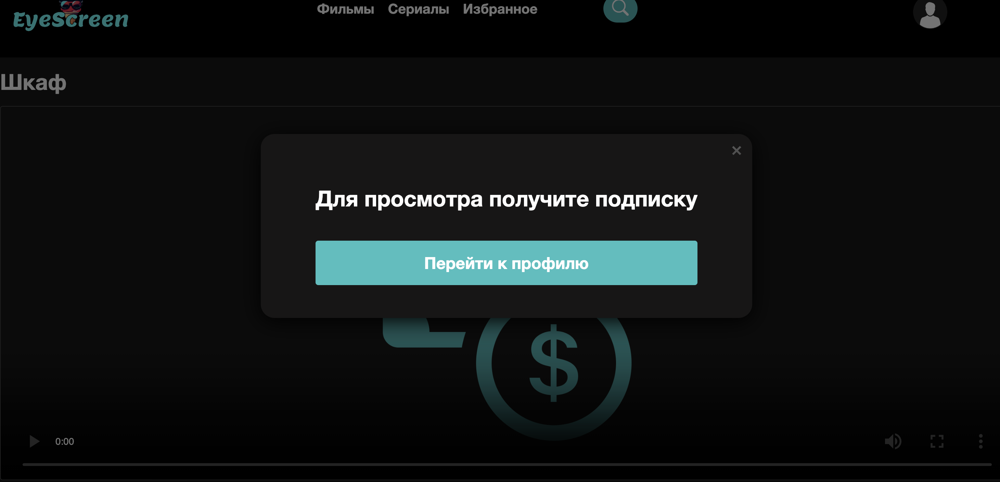 |     
| 3 | При наличии подписки загружается видео                                                                                 | Положительно |  |
| 4 | При наличии подписки работает перемотка видео                                                                          | Положительно |                                           |
| 5 | Работают переходы на страницы актеров                                                                                  | Положительно |                                           |
| 6 | При наличии подписки работает запоминание момента в видео при обновлении страницы                                      | Положительно |                                           |

# Страница Сериала
| № | Название проверки                                                                                                       | Результат    | Скриншот                                  |
|---|-------------------------------------------------------------------------------------------------------------------------|--------------|-------------------------------------------|
| 1 | При отсутствии подписки нет возможности воспроизвести видео                                                             | Положительно |  |        
| 2 | При отсутствии подписки при переходе на страницу сериала показываем окно с информацией о подписке и переходом на оплату | Положительно |  |       
| 3 | При наличии подписки загружается видео                                                                                  | Положительно | 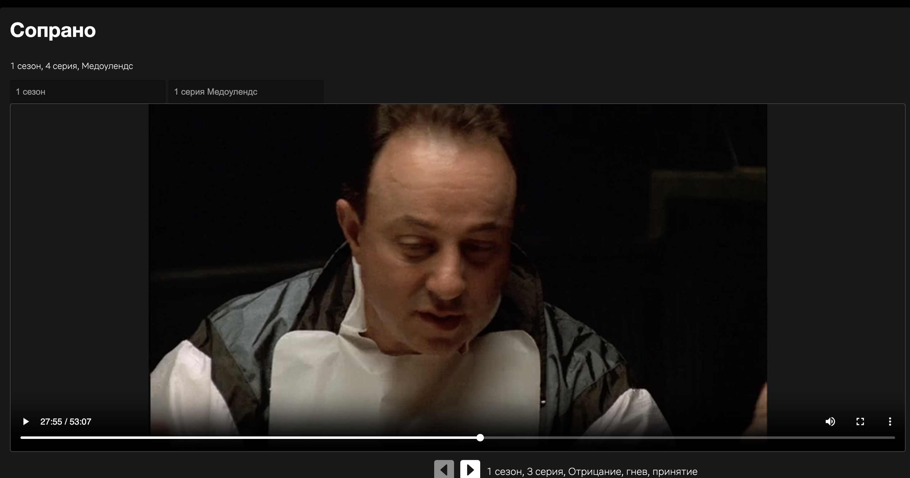 |          
| 4 | При наличии подписки работает перемотка видео                                                                           | Положительно |                                           |          
| 5 | Работают переходы на страницы актеров                                                                                   | Положительно |                                           |          
| 6 | При наличии подписки работает запоминание момента в видео при обновлении страницы                                       | Положительно |                                           |
| 7 | Работает навигация по сезонам и сериям                                                                                  | Положительно | 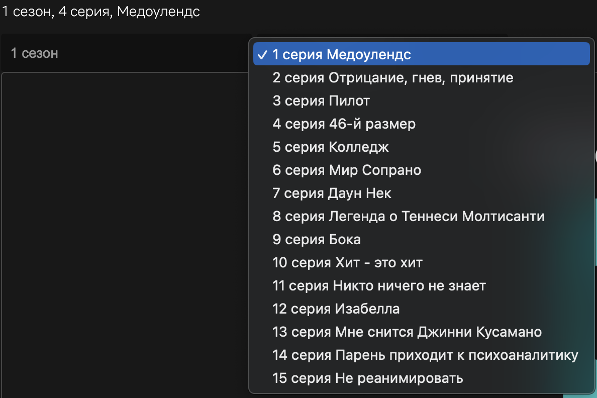 |       
| 8 | Работает навигация по каруселям                                                                                         | Положительно |  |

# Страница Актера
| № | Название проверки                                       | Результат      | Скриншот                                   |
|---|---------------------------------------------------------|----------------|--------------------------------------------|
| 1 | Отображается блок с инфо о актере и фото                | Положительно   | 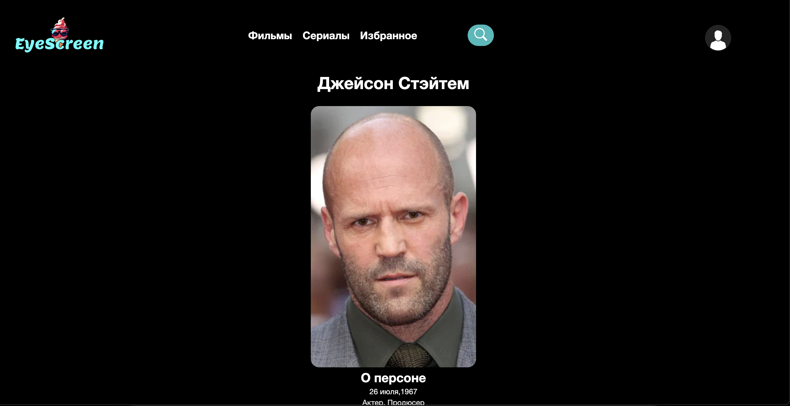 |
| 2 | Инфо об актёре содержит дату и место рождения           | Положительно   |                                            |
| 3 | Отображается блок с фильмами данного актёра             | Положительно   | 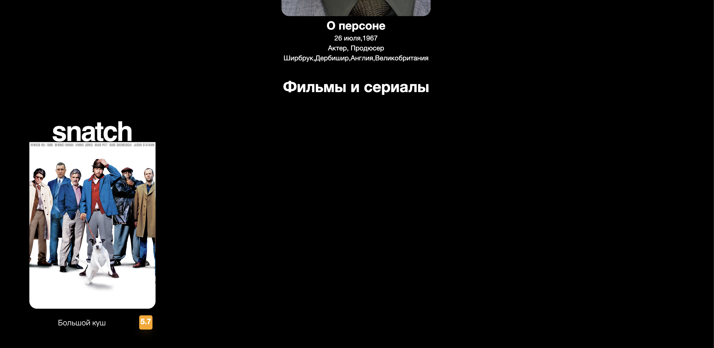   |
| 4 | Клик по названию контента - переход на сериал или фильм | Положительно   |                                            |
| 5 | Пользователь не может редактировать данные об актёре    | Положительно   |                                            |

